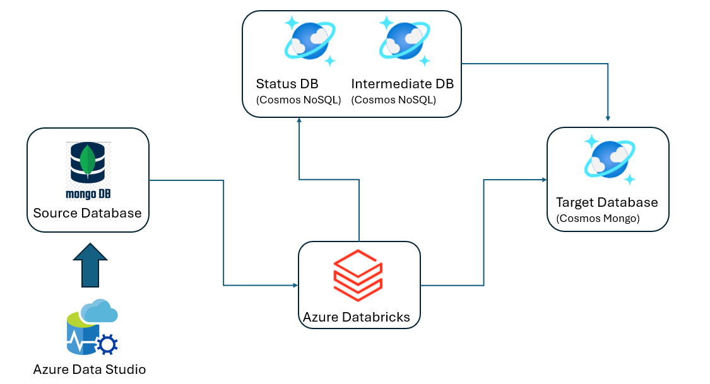

# MongoDB to Azure Cosmos DB for Mongo DB- Spark Utility User Guide

## Online / Offline Migration Mechanizm

- Offline Migration:  A snapshot based bulk copy from source to target. New data added/updated/deleted on the source after the snapshot will not be copied to the target. The application downtime required will depend on the time taken for the bulk copy activity to complete.

- Online Migration: Apart from the bulk data copy activity done in the offline migration, a change stream monitors all additions/updates/deletes and stores them into an intermediate data store. After the bulk data copy is completed the data in the intermediate is copied to the target to make sure all updates done during the migration process are also copied to the target. The application downtime required will be minimal.  

 

### Connection Strings 

The migration tool uses connection strings to connect the following resources. 

- Source Mongo DB Cluster/endpoint 
- Target Cosmos DB MongoDB account 

Intermediate Cosmos DB NoSQL account (only in case of Online Migrations)

- Status Cosmos DB NoSQL account

Verify the connection strings by using appropriate utilities to establish connections. In case of network restrictions on the source please refer to the previous section to configure your network settings.  

 

## Configuration JSON Setup

The migration tool configuration setting is supplied via a JSON file. This JSON contains three main blocks. The details of each block and its parameters details are provided below.

### Servers Block

The migration connects to the following resources to process the migration. The server block is used to define the various servers involved and their connection details.

- Source Mongo DB instance/endpoint
- Target Cosmos DB MongoDB account
- Intermediate Cosmos DB NoSQL account (only in case of Online Migrations): When an online migration is performed, the tool starts a change feed tracker to keep track of the updates made to the source while the bulk data migration activities are in progress. This change feed is stored in a Cosmos DB NoSQL account and utilized by the tool to update the target once the bulk data transfer activities are finished.
- Status Cosmos DB NoSQL account:  The migration tool stores its logs in a Cosmos NoSQL account. The debugging process involves examining the following collections in the status server.
  * _status: Each collection that is part of the migration has an entry that provides information about the migration status and the number of records migrated. To understand how to interpret the data within the _status collection, please refer to the appendix below.
  * _error: The migration tool records an entry for all documents that could not be inserted in the first attempt. It logs the document IDs of these failed documents. However, it is possible that these documents were eventually inserted as the job made multiple attempts for failed documents. To understand how to read the entries of this collection, please refer to the appendix below.
Sample Server block shown below.
  <pre>
  <code>
  ...
  "servers": { 
    "sourceServer1": { 
        "type": "MONGODB", 
        "name": "sourceServer1", 
        "url": "mongodb://.." 
        }, 
    "sourceServer2": { 
        "type": "MONGODB", 
        "name": "sourceServer2", 
        "url": "mongodb://.." 
        }, 
    "destinationServer": { 
        "type": "MONGODB", 
        "name": "destinationServer", 
        "url": "mongodb://.." 
        }, 
    "intermediateServer": { 
        "type": "COSMOSDB", 
        "name": "intermediateServer", 
        "url": "https://..", 
        "key": ".." 
        }, 
    "statusServer": { 
       "type": "COSMOSDB", 
       "name": "statusServer", 
       "url": "https://..", 
       "key": ".." 
       } 
  } 
  ...
  </code>
  </pre>
Note:
- Both source and destination servers need to support MongoDB APIs and require the connection string to be specified in the JSON. 
- Intermediate and status servers are Cosmos DB for NOSQL servers, requiring endpoint and key specifications. 
- Connectivity to all 4 endpoints from Azure Data Bricks cluster is necessary. 
- The server names (e.g. statusServer, destinationServer, sourceServer2) are user-defined label for identifying the server in the JSON. The same names are used in the Tasks block to reference the server.  

### Tasks Block
The Tasks block defines the various migration tasks to be performed. Each task includes source, destination, and intermediate blocks. The controls that are available are:
- Index Creation  
- Unique Constraint Violation Handling 
- Column Modifications (rename, copy, concatenate, delete, value randomization) 
- Rollback

Sample Tasks block shown below.
  <pre>
  <code>
  ...
"tasks":[
   {
      "migrationUnit":"COLLECTION",
      "source":{
         "serverName":"sourceServer1",
         "databases":[
            "streamdb"
         ],
         "collections":[
            "compositekeycollection",
            "emptycollection"
         ],
         "throughput":1000
      },
      "intermediate":{
         "serverName":"intermediateServer",
         "throughput":1000
      },
      "destination":{
         "serverName":"destinationServer"
      },
      "rollback":{
         "serverName":"sourceServer",
         "databases":[
            "newstreamdb"
         ],
         "collections":[
            "compositekeycollection_rollback",
            "emptycollection_rollback"
         ]
      },
      "uniqueConstraintViolationHandling":"RANDOM_ID",
      "indexCreation":"ALL_INDEXES",
      "enableAnalyticalStore":true,
      "filter":"{field:{$lt:24}}",
      "batchCount":30,
      "modifier":{
         "renameColumns":{
            "sourceData":"NewSourceData"
         },
         "deleteColumns":[
            "id2"
         ],
         "copyColumns":{
            "NewSourceData":[
               "AnotherNewSourceData",
               "sourceData"
            ],
            "_id":[
               "id1",
               "id2"
            ]
         },
         "timestampColumns":{
            "shardKey":{
               "format":"MMM-yyyy",
               "timestampField":"ts"
            }
         },
         "concatColumns":{
            "concatField":{
               "separator":"-",
               "fields":[
                  "id1",
                  "NewSourceData"
               ]
            }
         },
         "stringRandomizeColumns":[
            "field1",
            "field2"
         ],
         "integerRandomizeColumns":[
            "field3",
            "field4"
         ],
         "uuidRandomizeColumns":[
            "field5",
            "field6"
         ]
      }
   },
   {
      "migrationUnit":"DATABASE",
      "source":{
         "serverName":"sourceServer1",
         "databases":[
            "Category"
         ],
         "migrationThroughput":10000,
         "throughput":1000
      },
      "intermediate":{
         "serverName":"intermediateServer",
         "throughput":1000
      },
      "destination":{
         "serverName":"destinationServer"
      },
      "excludedCollections":[
         "coll1"
      ]
   },
   {
      "migrationUnit":"SERVER",
      "source":{
         "serverName":"sourceServer2",
         "throughput":5000
      },
      "intermediate":{
         "serverName":"intermediateServer"
      },
      "destination":{
         "serverName":"destinationServer"
      },
      "excludedDatabases":[
         "config",
         "admin",
         "local",
         "DB-1"
      ]
   }
],
  ...
  </code>
  </pre>

The attributes in the Tasks block are:

- migrationUnit: A task can be either server, database tasks or collection tasks. It can have values: SERVER, DATABASE, COLLECTION.
  * A server task migrates all databases and collections. When you migration a whole server, there are system databases that will give read error. Use the execludedDatabases to solve this issue. 
  * A database task migrates all databases (along with its collections) listed in the databases array.  

A collection task migrates all collections listed in the collections array.

- databases: An array that’s used in source, destination, and intermediate blocks. For a server task, the databases array can be ignored as all databases within the server will be migrated. databases is required when your migration unit is DATABASE, also databases in source is important, but if you provide these values in destination and intermediate, the count of these values have to be same.  Use databases in intermediate blocks only if you want to change the name in intermediate, else you don’t need to mention it.
- collections: An array used in source, destination, and intermediate blocks. For a database task, the collections array can be ignored as all collections within the database will be migrated. collections is required when your migration unit is COLLECTION. Use collections in intermediate blocks only if you want to change the name in intermediate, else you don’t need to mention it.
- execludedDatabases: Is used to exclude a set of databases from migration when doing server level migration. This can be a list of Java supported regular expressions as well.
- excludedCollections:  Is used to exclude collections in database level migration. This also can be a list of Java supported regular expressions.
- If you wish to create collections with specific RUs, you can add these in destination element with two attributes, throughput and migrationThroughput. If you provide only throughput, then the collection is provisioned with those RUs, if you define both throughput and migrationThroughput, then for bulk copy we provision a collection with migrationThroughput and then change the RUs to throughput at the end of bulk copy. Please keep in mind, if you are provisioning a collection with more than 10000 RUs, you will also need to provide a shardKey.
- uniqueConstraintViolationHandling: Is used to decide how to handle unique constraint violations. It can have three values, NOTHING, RANDOM_ID, and IGNORE. NOTHING carries forward the old behaviour, i.e., a unique constraint exception is thrown, and job terminates. RANDOM_ID will assume that constraint violation is because of a duplicate _id field and will replace the _id field with a new randomly generated ObjectId. IGNORE will just log the erroneous record and continue the migration.
- modifier:can be used when we want to make changes to source document before writing. 
  * renameColumns can be used to rename a column from old value to new value. 
  * copyColumns can be used to copy values from existing columns to new columns.  
  * deleteColumns can be used to remove certain columns before writing them to destination. 
  * concatColumns can be used to create a composite column from a number of source columns. The order of execution of these modifications is rename, copy, delete, and concat.
- There are three additional modifiers available that can be used to anonymizing the data. These are stringRandomizeColumns, integerRandomizeColumns, and uuidRandomizeColumns. These can contain a list of document fields and the content of those fields are replaced with random values while migration. For stringRandomizeColumns, the length of string remains same as what was existing value. If the value is null and default length of 10 is used.
- indexCreation: can be used to control creation of indexes while migration job is running. It can have following values "NONE", "ALL_INDEXES", "ONLY_UNIQUE_INDEXES", "ONLY_NON_UNIQUE_INDEXES". This can be defined for each task that is defined in the JSON.
- If you wish to enable analytical store in Cosmos DB for Mongo API, you can set enableAnalyticalStore to true at the task level. For this to work, Azure Synapse Link feature should be enabled for the account.
- batchCount: is a paramter at each task level that lets us control how many records we should be writing as a batch. By default, it is set to job level copyBatchSize parameter. But we can selectively change it for each job.
- rollback: If you wish to rollback the destination to source at some time using bulk copy, you can define a rollback block. Please see example in the JSON below. The rollback block can be used to specify a different server, database and collection depending on the migration unit that is being used. Please understand that this is an offline migration, and all traffic has to be stopped to get a consistent result. When using this feature, you have to specify com.microsoft.azure.cosmosdb.migration.RollbackMigration as the main class in the databricks job.  

### Status Block
The Status block contains details of the status database. This database can be created in the same account as the intermediate database. Provisioning around 10000 RUs autoscale is recommended. 

Sample Status block shown below.
  <pre>
  <code>
  ...
  "status":{
   "serverName":"statusServer",
   "database":"testdb",
   "collection":"stream_migration_status",
   "throughput":1000
   },
   "copyPartitions":100,
   "copyBatchSize":30,
   "streamingPartitions":100,
   "streamingBatchSize":30,
   "startStreamToIntermediate":true,
   "startBulkCopy":true,
   "startStreamToDestination":true,
   "offHeapMemory":false
  ...
  </code>
  </pre>

Choose between offline or online migration.

- For offline migration (set startBulkCopy to True)  
- For online migration (startBulkCopy , startStreamToIntermediate and startStreamToDestination to True).

The other attributes in the Status block are:

- offHeapMemory: at the job level is the parameter that can be used to control if we want to use off heap memory. By default, it is turned off because using off heap memory for large containers seems to have a performance penalty. But if we see recurring memory errors of GC errors, we can turn it on just for that job. 
- CopyPartitions: This parameter is used to define how many spark partitions we want to use. Suggested value is100 
- CopyBatchSize: This parameter defines the batch size that is used during migration. Suggested value is 20 – 30. 
- StreamingPartitions: Similar to copyPartitions but for change stream. suggested value is100. 
- StreamingBatchSize:  Similar to copyBatchSize but used for change streams. suggested value is 20 – 30. 
- StartBulkCopy: This parameter controls whether the migration should do bulk copy or not. 
- StartStreamToIntermediate:  This parameter is used to control whether we want to just do one time copy or do an online migration. This parameter starts a change stream from source database to intermediate database before starting the bulk copy so that we can have a checkpoint. 
- StartStreamToDestination:This parameter controls whether the migration job should perform a change stream copy to destination or not. Please be careful in using parameters 5, 6 and 7. There are only three realistic options here.

To set up the configuration JSON file for your migration, modify the JSON template below to match your migration requirements.
  <pre>
  <code>
  ...
  FULL JSON HERE
  ...
  </code>
  </pre>

 

## Data Bricks Job Configuration Process

### Create Azure Databricks cluster.

1. Log in to portal.azure.com. 
2. Click "Create a resource." 
3. Type "databricks" in the search box, locate "Azure Databricks," and click "Create." 
4. Choose your subscription and resource group. If the resource group doesn't exist, create one for this job. 
5. Provide a name for the Databricks workspace. 
6. Opt for the same region as your MongoDB database (if hosted on Azure) or your Cosmos for MongoDB account. 
7. If you desire a specific VNet for the job Click on "Networking." Select "Yes" for "Deploy Azure Databricks workspace in your own Virtual Network (VNet)."
  - Choose the VNet's name.
  - Specify a name for the public subnet.
  - Determine an available IP address range from your VNet's address space.
  - Assign an IP address range to both the public and private subnets. For example, if your VNet's address space is 10.7.0.0/16, you could use 10.7.101.0/24 for the public subnet and 10.7.100.0/24 for the private subnet.
8. Click "Review + create."
9. Click "Create."
10. Once created, click "Go to resource."  

### Configure Azure Databricks for migration.

1. Open the Azure Databricks resource created in the above step. 
2. Click "Launch Workspace." 
3. Choose your preferred option in the personalization dialog. 
4. Click "Workflows." From the left blade 
5. Click "Create Job." 
6. In the dialog, complete the following:
  - Assign a name to the task.
  - Select "JAR" for Type.
  - For the main class: the class name should be selected based on the task you want to perform.
    * Use com.microsoft.azure.cosmosdb.migration.MongoToCosmosMigration for standard migration. 
    * Use com.microsoft.azure.cosmosdb.migration.ResumeMongoToCosmosMigration for resuming a job (provide the SessionId as an argument).
    * Use com.microsoft.azure.cosmosdb.migration.CompareAndUpdate to compare and update if document counts differ in source and destination.
    * Use com.microsoft.azure.cosmosdb.migration.CompareAndUpdateWithStream to incrementally compare and update if a job failed before bulk copy completion (provide SessionId).
    * Use com.microsoft.azure.cosmosdb.migration.ResumeStreams to start streams after verifying document count (provide SessionId).
7. Choose a Shared job cluster.
8. Click on the edit icon in the Shared_job_cluster section.
  - Select the Databricks runtime version: Runtime: 12.2(includes Apache Spark 3.3.1, Scala 2.12). 
  - Choose an appropriate worker type based on your database size. 
  - For Driver type, select "Same as worker." 
  - Click "Confirm." 
9. Upload the utility jar from the Git repository (latest release version).  
10. Add the following dependent jars using Maven 
  - org.mongodb.spark:mongo-spark-connector_2.12:10.1.1 
  - com.azure.cosmos.spark:azure-cosmos-spark_3-3_2-12:4.17.2 
  - com.azure:azure-cosmos:4.41.0 
11. You should see a total of 4 JAR files after upload. 
12. Create the Job by clicking "Create." 
13. Provide a name. 
14. After the job is created, click on the job name in the Workflows screen. 
15. Click on "Configure" in the "Compute" section on the right-hand side pane. 
16. Scroll down to the bottom in the cluster config dialog. 
17. In Advanced options, add the following Spark configuration options(edit the values with <..> before pasting)  and then click "Confirm."
  <pre>
  <code>
  ...
spark.driver.extraJavaOptions -XX:+UseG1GC -XX:G1HeapRegionSize=16M -XX:+PrintFlagsFinal -XX:+PrintReferenceGC -XX:+PrintGCTimeStamps -XX:+PrintGCDateStamps -verbose:gc -XX:+PrintGCDetails -XX:+PrintAdaptiveSizePolicy -XX:AdaptiveSizePolicyOutputInterval=1 -XX:+UnlockDiagnosticVMOptions -XX:+G1SummarizeConcMark -XX:MaxDirectMemorySize=4096M -XX:-ResizePLAB -XX:+UseCompressedOops -XX:InitiatingHeapOccupancyPercent=45 -XX:+UnlockExperimentalVMOptions -XX:G1MixedGCLiveThresholdPercent=85 -XX:ParallelGCThreads=16 -XX:ConcGCThreads=4 
spark.databricks.delta.preview.enabled true 
spark.executor.cores <numberOfCoreInOneInstance> 
spark.executor.memory <2*numberOfCoresInOneInstance>g 
spark.memory.offHeap.enabled true 
spark.memory.offHeap.size <1/4 * totalMemoryInInstance>g 
spark.executor.memoryOverheadFactor .1 
spark.executor.instances 115 
spark.driver.memory 16g 
spark.executor.extraJavaOptions, -XX:-UseParallelGC -XX:+UseG1GC -XX:+PrintFlagsFinal -XX:+PrintReferenceGC -verbose:gc -XX:+PrintGCDetails -XX:+PrintGCTimeStamps -XX:+PrintAdaptiveSizePolicy -XX:+UnlockDiagnosticVMOptions -XX:+G1SummarizeConcMark -XX:InitiatingHeapOccupancyPercent=25 -XX:MaxGCPauseMillis=500 -XX:+ExplicitGCInvokesConcurrent 
spark.driver.memoryOverheadFactor .1 
spark.databricks.libraries.enableMavenResolution false 
spark.driver.cores 14 
spark.task.maxFailures 1 
  ...
  </code>
  </pre>

### Job Parameters

Parameters for the job must be provided in a JSON file, which includes multiple migrations to be executed within a single job. Assuming you have already created and uploaded the JSON file, provide the file path as specified below.

For detailed steps (with screenshots) on how to upload the Job parameters file follow the link: Migration Utility Steps (Databricks) - Overview (azure.com)

  <pre>
  <code>
  ...
  ["-Dmigrator.parametersJsonFile=/FileStore/tables/migration_settings-1.json"]
  ...
  </code>
  </pre>

Now our Job is ready, and we can run it.  

If there are any transient errors these are logged into the status database and retried at the end of the job. If there is any error that requires manual intervention, we can run a resume job manually to complete it. For running a resume job, we need to add two parameters in our job parameters.  

  <pre>
  <code>
  ...
  ["-Dmigrator.parametersJsonFile=/FileStore/tables/migration_settings-1.json", “-Dmigrator.resumeJobId=UUID”, “-Dmigrator.resumeSessionId=UUID”] 
  ...
  </code>
  </pre>

These values can be located in our status account within the migration_status collection. When both the resumeSessionId and resumeJobId parameters are provided, only a single task will be retried. However, if only the resumeSessionId parameter is provided, all tasks will be retried. This process involves manually copying all documents from the source to the destination, making it a relatively harmless operation. This resume job serves as a helpful solution when most documents have been migrated successfully, with only a small fraction encountering errors.

### Spark Scheduler

When migrating multiple containers of varying sizes, setting the scheduler to "fair" is advisable. To enable this, create a file named "fairscheduler.xml" with appropriate content. Upload this file to Databricks' data section. Also, add the property spark.scheduler.allocation.file file:///dbfs//FileStore/tables/fairscheduler.xml to the cluster configuration.
