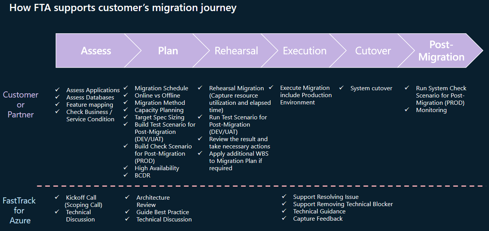

# Cosmos MongoDB Migration

## Migration Journey

 

### 1. Assessment

- Check Cosmos DB features, syntax and limits
  * [Azure Cosmos DB for MongoDB (4.2 server version): Supported features and syntax](https://learn.microsoft.com/en-us/azure/cosmos-db/mongodb/feature-support-42)
  * [Limits and Quotas](https://learn.microsoft.com/en-us/azure/cosmos-db/concepts-limits#resource-limits)
  * [MongoDB compatibility and feature support with Azure Cosmos DB for MongoDB vCore](https://learn.microsoft.com/en-us/azure/cosmos-db/mongodb/vcore/compatibility)  

- Assess Applications
  * Interview each Application / System Owner
  * Dependency Check  

- Assess Source Databases
  * [Azure Data Studio for MongoDB Extension](https://learn.microsoft.com/en-us/sql/azure-data-studio/extensions/database-migration-for-mongo-extension?view=sql-server-ver16)
  * [Migration Assessment Helper Shells](01_Assessment/01_01.Assessment_Shell.md)  

- Check Business/Service Condition
  * Interview each Service / System Owner
  * Maximum available downtime for each system
  * Available downtime & schedule (Day & Time) for each system  

 

### 2. Planning

- Migration Timeline & Schedule  

- Azure Cosmos DB Mapping
  * RU-Base vs vCore Base: [What is RU-based and vCore-based Azure Cosmos DB for MongoDB?](https://learn.microsoft.com/en-us/azure/cosmos-db/mongodb/choose-model)
  * Dedicated vs Shared Throughput: [Introduction to provisioned throughput in Azure Cosmos DB](https://learn.microsoft.com/en-us/azure/cosmos-db/set-throughput)
  * Shard Key & Partitioning: [Partitioning and horizontal scaling in Azure Cosmos DB](https://learn.microsoft.com/en-us/azure/cosmos-db/partitioning-overview#choose-partitionkey)
  * [Best practices for scaling provisioned throughput (RU/s)](https://learn.microsoft.com/en-us/azure/cosmos-db/scaling-provisioned-throughput-best-practices)  

- Capacity Planning & Target Spec Sizing
  * [Convert the number of vCores or vCPUs in your nonrelational database to Azure Cosmos DB RU/s](https://learn.microsoft.com/en-us/azure/cosmos-db/convert-vcore-to-request-unit)
  * [Estimate RU/s using the Azure Cosmos DB capacity planner - Azure Cosmos DB for MongoDB](https://learn.microsoft.com/en-us/azure/cosmos-db/mongodb/estimate-ru-capacity-planner)
  * [How to choose between standard (manual) and autoscale provisioned throughput](https://learn.microsoft.com/en-us/azure/cosmos-db/how-to-choose-offer)
  * [How to choose between provisioned throughput and serverless](https://learn.microsoft.com/en-us/azure/cosmos-db/throughput-serverless)
  * [Databricks Cluster Sizing for Online Migration](02_Planning/02_03.Databricks_Cluster_Sizing.md)  
  
- Online vs Offline

| Mode | Pros  | Cons  |
|------|-------|-------|
| Offline | - Simple, easy and less complex to execute. | Downtime to applications. |
|         | - Very fewer chances of failure.            |                           |
|         | - No restrictions in terms of database objects it can handle|           |
| Online  | - Very minimal downtime to application. | - Online migration with Databricks has multiple restrictions listed in this [doc](02_Planning/02_01.Online_MIG_Restrictions.md) |
|         | - Ideal for large databases and for customers having limited downtime requirements. | - Tough and much complex to execute than offline migration. |
|         |                        | - Greater chances of failure due to complexity of migration. |
|         |                        | There is an impact on the source server's storage and compute if the migration runs for a long time. The impact needs to be monitored closely during migration. |

- Migration Method
  * [Azure Cosmos DB API for MongoDB](https://learn.microsoft.com/en-us/azure/cosmos-db/migration-choices#azure-cosmos-db-api-for-mongodb)
  * [Azure Cosmos DB for MongoDB vCore](02_Planning/02_02.Mongo_vCore_Migration.md)  

- Build Test Scenario for Post-Migration (DEV/UAT)
  * Unit Test for Important or Mission Critical Task
  * Performance Validation
- Build Check Scenario for Post-Migration (PROD)
  * Check Server Configurations & Optimize if required
  * Check Data Consistency  

- [Backup & Recovery (RTO/RPO)](https://learn.microsoft.com/en-us/azure/cosmos-db/online-backup-and-restore)
- [High Availability & BCDR](https://learn.microsoft.com/en-us/azure/cosmos-db/high-availability)

 

### 3. Rehearsal

- Rehearsal Migration in DEV/UAT Environment
  (Capture Resource Utilization and Elapsed Time)
- Run Test Scenario for Post-Migration (DEV/UAT)
- Review the result and take necessary actions
- Apply additional WBS to Migration Plan if required
- [Known Issues with Databricks](03_Rehearsal/03_01.Known_Issues_with_Databricks.md)
- [Troubleshooting Guides](03_02.Troubleshooting_Guides.md)

 

### 4. Execution

- Execute Migration including Production Environment
- [Monitoring Guide for Online Migration with Databricks](04_Execution/04_01.Monitoring_Online_Databricks.md)

 

### 5. Cut-Over

- System Cut-Over

 

### 6. Post-Migration

- Run System Check Scenario for Post-Migration(PROD)
- Monitoring & Remedation
- [Post-migration optimization steps when using Azure Cosmos DB's API for MongoDB](https://learn.microsoft.com/en-us/azure/cosmos-db/mongodb/post-migration-optimization)
- [Best practices for scaling provisioned throughput (RU/s)](https://learn.microsoft.com/en-us/azure/cosmos-db/scaling-provisioned-throughput-best-practices)  

 

# Fast Track for Azure Support

## Migration Journey with FTA

