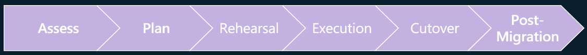

# CosmosMongoDBMigration

## Migration Journey

### 1. Assessment

- Check Cosmos DB features, syntax and limits
  * [Azure Cosmos DB for MongoDB (4.2 server version): Supported features and syntax](https://learn.microsoft.com/en-us/azure/cosmos-db/mongodb/feature-support-42)
  * [Limits and Quotas](https://learn.microsoft.com/en-us/azure/cosmos-db/concepts-limits#resource-limits)
  * [MongoDB compatibility and feature support with Azure Cosmos DB for MongoDB vCore](https://learn.microsoft.com/en-us/azure/cosmos-db/mongodb/vcore/compatibility)  

- Assess Applications
  * 1234  

- Assess Source Databases
  * [Azure Data Studio for MongoDB Extension](https://learn.microsoft.com/en-us/sql/azure-data-studio/extensions/database-migration-for-mongo-extension?view=sql-server-ver16)
  * [Migration Assessment Helper Shells](01_Assessment/01_01.Assessment_Shell.md)  

- Check Business/Service Condition
  * Interview each Service / System Owner
  * Maximum available downtime for each system
  * Available downtime schedule (Day & Time) for each system  

### 2. Planning

- Migration Timeline & Schedule
- Online vs Offline
| Mode | Pros | Cons |
|------|------|------|
| Offline | - Simple, easy and less complex to execute. | Downtime to applications. |
|         | - Very fewer chances of failure.            |                           |
|         | - No restrictions in terms of database objects it can handle|           |
| Online | Tutorial: Migrate Azure Database for PostgreSQL - Single Server to Flexible Server (Portal) | [Link](https://learn.microsoft.com/en-us/azure/postgresql/migrate/how-to-migrate-single-to-flexible-portal) |

- Cosmos DB for Mongo DB RU-Base vs vCore
  * 1234

- Migration Method
  * [Offline: Single to Flexible Migration tool (Recommended)](https://learn.microsoft.com/en-us/azure/postgresql/migrate/concepts-single-to-flexible#single-to-flexible-migration-tool---overview)
  * [Offline: Migrate your PostgreSQL database by using dump and restore](https://learn.microsoft.com/en-us/azure/postgresql/migrate/how-to-migrate-using-dump-and-restore)
  * [Offline: Migrate your PostgreSQL database using export and import](https://learn.microsoft.com/en-us/azure/postgresql/migrate/how-to-migrate-using-export-and-import)
  
  * [Online: Single to Flexible Migration tool](https://learn.microsoft.com/en-us/azure/postgresql/migrate/concepts-single-to-flexible#single-to-flexible-migration-tool---overview)
  * [Online: Minimal-downtime migration with DMS](https://learn.microsoft.com/en-us/azure/postgresql/migrate/how-to-migrate-online)
  * [Online: Minimal-downtime migration with Debezium Kafka](https://debezium.io/releases/)

- Capacity Planning & Target Spec Sizing
- Build Test Scenario for Post-Migration (DEV/UAT)
  * Unit Test for Important or Mission Critical Task
  * Performance Validation
- Build Check Scenario for Post-Migration (PROD)
  * Check Server Configurations & Optimize if required
  * Check Data Consistency
  * Check Statistics
- [Backup & Recovery (RTO/RPO)](https://learn.microsoft.com/en-us/azure/postgresql/flexible-server/concepts-backup-restore)
- [High Availability & BCDR](https://learn.microsoft.com/en-us/azure/reliability/reliability-postgresql-flexible-server?toc=%2Fazure%2Fpostgresql%2Ftoc.json&bc=%2Fazure%2Fpostgresql%2Fbreadcrumb%2Ftoc.json)

### 3. Rehearsal

- Rehearsal Migration in DEV/UAT Environment  
  (Capture Resource Utilization and Elapsed Time)
- Run Test Scenario for Post-Migration (DEV/UAT)
- Review the result and take necessary actions
- Apply additional WBS to Migration Plan if required
- [Common Errors](https://learn.microsoft.com/en-us/azure/postgresql/migrate/common-errors-and-special-scenarios-fms)
- [Troubleshooting Guides](https://learn.microsoft.com/en-us/azure/postgresql/flexible-server/how-to-troubleshooting-guides)

### 4. Execution

- Execute Migration including Production Environment

### 5. Cut-Over

- System Cut-Over

### 6. Post-Migration

- Run System Check Scenario for Post-Migration(PROD)
- Monitoring & Remedation
